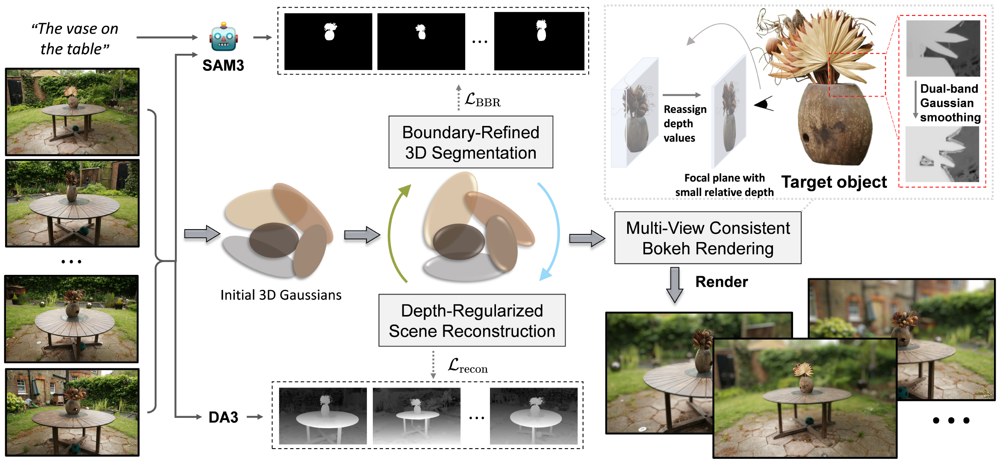

# BRG-Bokeh: Boundary-Refined 3DGS Segmentation for Multi-View Consistent Bokeh

> **Accepted at IEEE ICME 2026**

**Rui Huang**¹, **Haojie Tao**¹, **Sen Gao**¹, **Qing Guo**²,*  

¹Civil Aviation University of China, Tianjin, China  
²Nankai University, Tianjin, China

---

## Abstract

Generating consistent bokeh effects for foreground objects in 3D scenes across multiple viewpoints poses a significant challenge for single-image bokeh methods, due to inconsistent focus target localization and prominent boundary artifacts. To address these challenges, we propose a novel framework that integrates depth-regularized scene reconstruction and boundary-refined 3D segmentation to learn a 3D Gaussian Splatting (3DGS) representation. Specifically, we leverage Depth Anything v3 to generate monocular depth maps and SAM3 to produce text-prompt-driven masks, which respectively serve as ground truth for depth estimation and segmentation. This allows the learned 3DGS to simultaneously generate RGB images, depth maps, and spatially consistent masks of the target object across multiple views. Furthermore, we develop a multi-view consistent bokeh rendering method that reassigns depth values to pixels within the in-focus object and applies dual-band Gaussian smoothing to mitigate edge artifacts. Comprehensive experiments on segmentation and bokeh datasets demonstrate that our approach outperforms 3D segmentation methods and single-image bokeh methods. Notably, our method realizes flexible, natural, and multi-view consistent bokeh rendering, providing a promising solution for scenarios requiring highly precise and coherent defocus effects across multiple viewpoints.

---

## Paper

The full paper is available in the `paper/` folder:  
[📄 Paper (PDF)](paper/Paper%233019%20BRG-Bokeh%20Boundary-Refined%203DGS%20Segmentation%20for%20Multi-View%20Consistent%20Bokeh.pdf)

---

## Supplementary Material

Supplementary materials can be found here:  
[📎 Supplementary Material (PDF)](paper/Paper%233019%20supplementary.pdf)

---

## Pipeline Overview

